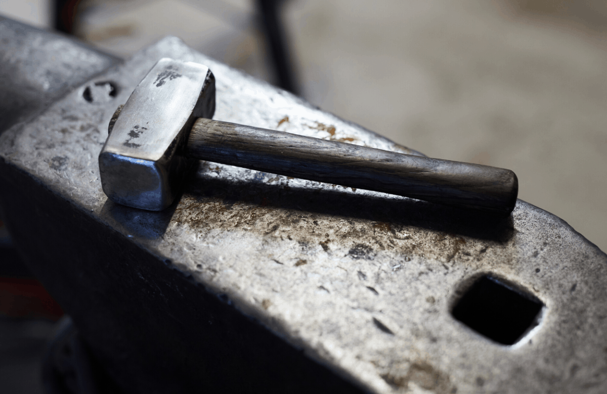

# `hammer`


The data interface for the thermal experiemnt and simulation data used in additive manufacturing.

## Requirements

* most comes from 
	```bash
	pip install -r requirements.txt
	```


## Contact

* [Achez](jiangcechen@gmail.com)

